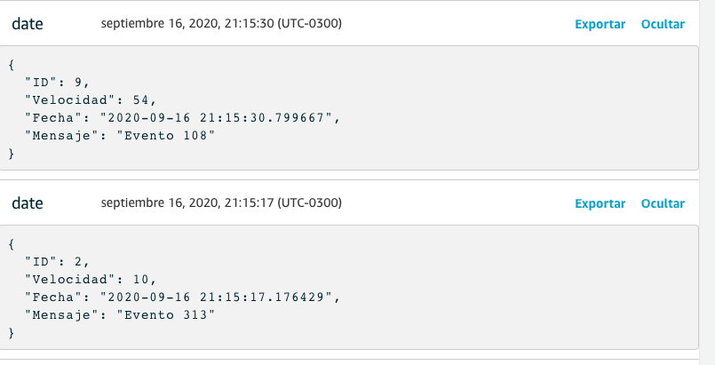
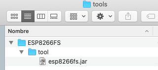
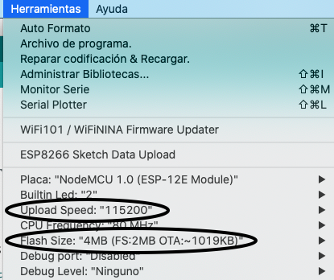
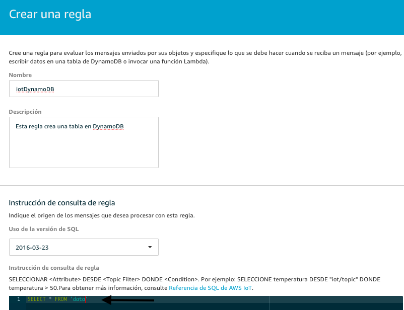
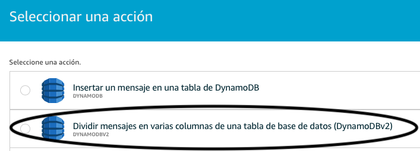
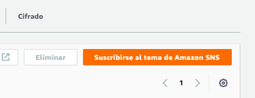

# Iniciando AWS IoT

En este repositorio vamos a aprender los primeros pasos para integrarnos a mundo de AWS IoT. 


Para conocer las ventajas y caracteristicas del mundo AWS IoT te inivito a visitar el siguiente link: [https://aws.amazon.com/es/iot/](https://aws.amazon.com/es/iot/)


Este tutorial consiste en tres ejercicios un primer ejercicio donde simularemos un dispositivo utilizando un programa simple en Python y otro usando un dispositivo real NodeMCU ESP8266, ambos para enviar mensajes a la nube AWS IoT Core, y en un tercero ejercicio cofiguraremos algunas acciones gatilladas con los mensajes enviados. 

---
---

## AWS IoT Core 


AWS IoT Core es un servicio en la nube administrado que permite a los dispositivos conectados interactuar de manera fácil y segura con las aplicaciones en la nube y otros dispositivos.


[Conoce más sobre AWS IoT Core](https://aws.amazon.com/es/iot-core/?nc=sn&loc=2&dn=3)

---
---

## Ejercicio 1: Enviar mensajes MQTT a AWS IoT Core desde Python. 

En este ejercicio, vamos a configurar un objeto de IoT en AWS IoT Core; una vez que tenga esa configuración, ejecutaremos un pequeño programa para simular el envío de datos a AWS IoT Core y luego usará el cliente de prueba MQTT para ver la carga útil de cada mensaje MQTT.


¿Que necesitas?

- [x] Una cuenta AWS. [Crea tu cuenta con capa gratuita](https://aws.amazon.com/es/free/?all-free-tier.sort-by=item.additionalFields.SortRank&all-free-tier.sort-order=asc)
- [x] Conocimientos en Python.
- [x] Configurada tus credenciales de acceso de la cuenta AWS. [Aca como lo puedes hacer](https://docs.aws.amazon.com/es_es/cli/latest/userguide/install-cliv2.html)

---

### Parte 1: Crear el objeto en AWS IoT Core.


Ir al servicio AWS IoT Core


En el siguiente menú seleccionar Click a **"Crear solo un objeto"**

Para este ejercicio le colocaremos el nombre de **objeto1** y le damos Click a **"Siguiente"**

En el siguiente paso debes darle Click a **"Crear Certificado"**

El certificado en unico por objeto es la forma recomendada de interactuar con los servicios de AWS IoT desde los dispositivos, 
lo que ofrece la capacidad de grabar la clave privada en el dispositivo al momento de la inscripción que luego nunca se transfiere a través de Internet junto con las solicitudes, una ventaja de seguridad. 


 

 Descargue el certificado y la clave privada para el dispositivo, y también el rootCA 1 . 


- Duplicar el archivo de certificado con el siguiente nombre **certificate.pem**
- Duplicar el archivo de privateKey con el siguiente nombre  **privateKey.pem**
- Duplicar el archivo de rootCA 1 con el siguiente nombre  **rootCA.pem**

 Asegúrese de presionar el botón de **"Activar"** para que se pueda usar el certificado. 


Finalice el proceso haciendo clic en el botón **"Listo"**. 

El siguiente punto es crear y adjuntar una política al certificado, que autorice al dispositivo autenticado a realizar acciones de IoT en los recursos de IoT.

Para crear la politica debes ir al menú del lado izquierdo **Seguridad -> Políticas** una vez ahí debes darle Click a **"Crear una Política"**, para efectos de este ejercicio la nombreremos **objeto1-policity**, complete los campos (Acción, ARN de recurso) con una estrella **"*"**, esto solo para efectos de este ejerccio ya que permite todo, y marque la opción Permitir efecto y luego presione el botón **"Crear"**.

Ahora en el menú del lado izquierdo **Seguridad -> Certificados**, verá el certificado que ha creado anteriormente, toque los tres puntos de la derecha y elija **Asociar política**, aparecerá una ventana emergente que muestra sus políticas existentes, verifique las recientes política que haya creado y asocie, finaliza activiando.

**¡¡Esto es todo Felicidades!! ya has creado tu primer objeto de AWS IoT con éxito, le has generado un certificado y le has adjuntado una política.**

---

### Parte 2: Simular dispositivo con programa en python.

En esta parte debes descargar el siguiente programa [ejercicio1.py](https://github.com/elizabethfuentes12/Iniciando_AWS_IoT/blob/master/ejercicio1.py) en la misma carpeta donde tienes los certificados descargados y renombrados en la parte anterior. 

Para que el programa funcione debes modificar lo siguiente: 

- Asegurate de tener configurada tus credenciales de acceso de la cuenta AWS. [Aca como lo puedes hacer](https://docs.aws.amazon.com/es_es/cli/latest/userguide/install-cliv2.html)

- En AWS Iot Core vas al menu de abajo a la izquierda en **"Coniguración -> Punto de enlace"** y copias y pegas aca el link que aparece en la siguiente linea reemplazando a "data.iot.us-west-2.amazonaws.com":
```
mqttc.configureEndpoint("data.iot.us-west-2.amazonaws.com",8883)
```


- Debes asegurarte que el nombre de tus certificados tenga los nombres a continuación y además que esten en la misma carpeta. 

```
mqttc.configureCredentials("./rootCA.pem","./privateKey.pem","./certificate.pem")
```
Configura el ambiente para ver los datos antes de activar el programa: 

Ve al menu de abajo a la izquierda **"Prueba"** y en Publicar especifica el mensaje que para nuestro caso de llama **"data"**, como lo puedes ver en e codigo. 

```
mqttc.publish("data", message, 0)
```


Finalizas dandole click a **"Suscribirse al tema"**

Ahora ejecuta el programa 

```
python ejercicio1.py
```

y si todo esta OK podrias empezar a ver la información. 



Para cancelar la ejecucion debes presionar **"ctrl + c"**

---
---

## Ejercicio 2: Enviar mensajes MQTT a AWS IoT Core desde NodeMCU ESP8266.

En este ejercicio usaremos el mismo objeto creado en el paso anterior. 


¿Que necesitas?

- [x] Una cuenta AWS. [Crea tu cuenta con capa gratuita](https://aws.amazon.com/es/free/?all-free-tier.sort-by=item.additionalFields.SortRank&all-free-tier.sort-order=asc)
- [x] Un NodeMCU ESP8266. Disponible en cualquier tienda on-line [ejemplo](https://www.amazon.com/-/es/Internet-desarrollo-inalámbrico-funciona-Micropython/dp/B07R4MVSCY/ref=sr_1_6?__mk_es_US=ÅMÅŽÕÑ&dchild=1&keywords=NodeMCU+ESP8266&qid=1600307883&sr=8-6).
- [x] Tener instalado en tu computador Arduino. [Link de descarga](https://www.arduino.cc/en/main/software)
- [x] Tener instalado en tu computador OpenSSL. [Link de como hacerlo](https://github.com/elizabethfuentes12/Iniciando_AWS_IoT/blob/master/instalarOpenSSL.md)

Puedes conocer un poco mas de NodeMCU en su [Datasheet](hhttps://www.esploradores.com/datasheet-nodemcu/)

---

### Parte 1: Convertir los certificados a DER. 

Hay dos métodos principales para codificar los datos del certificado.

DER = codificación binaria para datos de certificado
PEM = Codificación base64 del certificado codificado en DER, con líneas de encabezada y pie de página agregadas.


DER: (Reglas de codificación distinguidas) es un subconjunto de la codificación BER que proporciona exactamente una forma de codificar un valor ASN.1. DER está diseñado para situaciones en las que se necesita una codificación única, como en la criptografía, y garantiza que una estructura de datos que debe firmarse digitalmente produzca una representación serializada única.

PEM: (correo electrónico con privacidad mejorada) Simplemente un certificado DER codificado en US-ASCII por base64, solicitud de certificado o PKCS # 7, incluido entre delimitadores PEM típicos. es decir, “—– COMENZAR CERTIFICADO—–” and “—– FIN CERTIFICADO—–“. PEM es una abreviatura de Privacy Enhanced Mail (RFC 1421 - RFC 1424), uno de los primeros estándares para proteger el correo electrónico (IRTF, IETF). PEM nunca ha sido ampliamente adoptado como estándar de correo de Internet, pero se ha convertido en un estándar básico en x509 pki (también llamado pkix)

Dado que nuestro ESP8266 no comprende la codificación base64, convertiremos ese certificado a binario DER. 

Para continuar debes asegurarte que tengas instalado OpenSSL, pare evisar escrive en tu linea de comando:

```
openssl
```
Si la respuesta es:
```
OpenSSL>
```
Entonces lo tienes instalado y puedes seguir avanzando, de lo contrario revisa como hacerlo en este [Link](https://github.com/elizabethfuentes12/Iniciando_AWS_IoT/blob/master/instalarOpenSSL.md)

Una vez instalado OpenSSL, podremos usarlo para convertir nuestros certificados a DER usando los siguientes comandos en tu terminal: 

```
openssl x509 -in xxxxxxxxxx-certificate.pem.crt -out cert.der -outform DER 
openssl rsa -in xxxxxxxxxx-private.pem.key -out private.der -outform DER
openssl x509 -in AmazonRootCA1.pem -out ca.der -outform DER
```
Reemplaza el "xxxxxxxxxx" con el nombre de su certificado y AmazonRootCA1 seguirá siendo el mismo.

Después de ejecutar estos comandos, puedes ver que los certificados se guardan en la misma carpeta con formato .der, copie estos archivos en formato DER en una carpeta llamada **data**.

---

### Parte 2: Instalación de la herramienta para NodeMCU ESP8266 en Arduino IDE.

Primero aregurate de tener instalado Arduino, de no ser asi [Link de descarga](https://www.arduino.cc/en/main/software). 

Una vez te asegures de lo anterior debes revisar que Arduino tenga el complemento ESP8266 instalado. Si no sabes cómo instalar el complemento ESP8266, puedes revisar estos dos link: 

[Controlador NodeMCU ESP8266](https://github.com/elizabethfuentes12/Iniciando_AWS_IoT/blob/master/NodeMCU_ESP8266.md)

[NodeMCU programming with Arduino](https://electronicsinnovation.com/nodemcu-arduinoide/).

Ahora debemos cargar el complemento de Arduino ESP8266 que empaqueta los certificados en la carpeta de **data** en la memoria flash de nuestro ESP8266.

- Descarga la herramienta para pasar los archivos a la memoria del ESP8266 **"ESP8266FS-0.4.0.zip"** [Git hub releases page](https://github.com/esp8266/arduino-esp8266fs-plugin/releases/tag/0.5.0).

- Dentro de la carpeta de Arduino, cree una nueva carpeta con el nombre tools, si aún no existe y descomprima el **"ESP8266FS-0.4.0.zip"** dentro de ella y se debe ver como <carpeta arduino> /tools/ESP8266FS/tool/esp8266fs.jar).



Para que se pueda realizar la instalación debes asegurare que en preferencia este la carpeta raiz de donde se encuentra tu caprpeta tools para que pueda leer el .jar: 


- Reinicie Arduino IDE.
- Seleccione "herramientas> Carga de datos de boceto ESP8266" estará allí.


### Creditos de esta herramienta a: Hristo Gochkov.

---

### Parte 3: Descargando el certificado AWS en tu NodeMCU ESP8266.

Debes asegurarte que la carpeta **data** que contiene los certificados este en la misma carpeta donde se encuentra tu codigo Arduino, como se muestra a continuación.


---

### Parte 4: Modificar el código para el NodeMCU ESP8266 al servidor AWS IoT. 

Para que el código funcione debes: 

- Copia el codigo para arduino del siguiente [Link](https://github.com/elizabethfuentes12/Iniciando_AWS_IoT/blob/master/ejercicio2.txt), este al igual que el anterir se se suscribe al tema **"data"** por lo que no es necesario modficar nada de lo anterior. 

- Pega el código en una pestaña limpia de Arduino y modifica los siguietes parametros: 

En estas lineas van los datos de WIFI necesarios para que el NodeMCU ESP8266 se pueda conectar y enviar la informacion al servidor AWS IoT
```
const char* ssid ="Electronics_Innovation";
const char* password = "subscribe";
```

También debes cambiar el AWS_endpoint, como en el ejercicio 1,  que es la dirección del agente MQTT para su cuenta de AWS en una región específica.

```
const char* AWS_endpoint = "xxxxxxxxxxxxxx-ats.iot.us-west-2.amazonaws.com"; //MQTT broker ip
```


- Asegúrese de que el nombre de los archivos coincida con los nombres de sus certificados reales en la carpeta **dato**.

```
line no: 126> File cert = SPIFFS.open("/cert.der", "r"); //replace cert.crt eith your uploaded file name
line no:141 > File private_key = SPIFFS.open("/private.der", "r"); //replace private eith your uploaded file name
line no:158 > File ca = SPIFFS.open("/ca.der", "r"); //replace ca eith your uploaded file name
```
- Debes tener instaladas las siguientes librerias: 
```
#include "FS.h"
#include <ESP8266WiFi.h>
#include <WiFiUdp.h>
#include <PubSubClient.h>
#include <NTPClient.h>
```
<PubSubClient.h> --> [Si no la tienes descargala aca](https://www.arduinolibraries.info/libraries/pub-sub-client)

<NTPClient.h> --> [Si no la tienes descargala aca](https://www.arduinolibraries.info/libraries/ntp-client)

En el caso de compilar y te de error en **getFormattedDate** de NTPclient debes revisar que en **Arduino > libraries > NTPClient > NTPCliente.h** tenga la siguiente linea: 

```
String getFormattedDate(unsigned long secs = 0);
```
De lo cotrario puedes copiar y pegar la libereria de: 

[NTPClient](https://github.com/elizabethfuentes12/Iniciando_AWS_IoT/tree/master/libreria/NTPClient)

---
### Parte 5: Compilando y cargando el nuevo programa en NodeMCU ESP8266.

En esta parte vamos a enviar los mismos mensajes que enviamos en el ejercicio 1 pero desde nuestro dispositivo real.

- Conecta el NodeMCU ESP8266 al computador y asegurate que lo tome en el puerto adeduado: 


- Configura los siguientes parametros en Herramientas:

**Upload Speed: "115200"**

**Flash Size: "4MB"**




- Abre el código Arduino y seleccione el elemento de menú **Herramientas> ESP8266 Sketch Data Upload**. Esto debería comenzar a cargar los archivos en el la flash del ESP8266. Cuando termine, la barra de estado IDE mostrará el mensaje SPIFFS Image Uploaded. Puede que tarde unos minutos en sistemas.

- Compila el programa y si todo esta correcto subelo a tu NodeMCU ESP8266. 

- Ahora seremos capaces de ver los datos enviados en AWS IoT Core como lo hicimos en el ejercicio anterior. 

En el servicio de AWS IoT Core ve al menu de abajo a la izquierda **"Prueba"** y en Publicar especifica el mensaje que para nuestro caso de llama **"data"**, como lo puedes ver en e codigo. 

```
client.publish("data", msg);
```


Finalizas dandole click a **"Suscribirse al tema"**


 Tutorial estraido de [How to connect NodeMCU ESP8266 with AWS IoT Core using Arduino IDE & MQTT](https://electronicsinnovation.com/how-to-connect-nodemcu-esp8266-with-aws-iot-core-using-arduino-ide-mqtt/)

Tambien puedes ver la informacion enviada en Arduino desde **Monitor Serie** como se muestra en la imagen a continuación: 


---
---

## Ejercicio 3: Manejo de mensajes IoT en AWS Cloud.

---

### Parte 1: Crear una tabla DynamoDB con mensajes MQTT desde AWS IoT Core

Primero que todo debemos crear una tabla en DynamoDB en la cual escriberemos los datos, para esto debemos ir al servicio con su nombre y darle click en **"Crear Tabla"**, para nuestro ejercicio la nombraremos **"iot-prueba"** para las Claves principales usaremos los datos que enviamos desde nuestro programa **ID** y **Fecha**.


Asegurate que el contenido que envies sea "Cadena" = String al igual que la información en el json que envias de lo contrario no veras los datos en la dynamondDB.

Ahora debes crear la regla en AWS IoT Core, para eso ve al meno de abajo a la izquierda **Acto --> Regla** y dale al botón **Crear una Regla**


Debes llenar los campos: 
- Nombre: para nuestro ejercicio se llamara iotDynamoDB
- Descripción, no es un campo obligatorio pero es recomendable para que sepas que hace la regla. 
- Instrucción de consulta de regla, debes modificar la query a: 
```
SELECT * FROM 'data'
```


Paso siguiente en **Definir una o varias acciones**, le das al boto **Añadir Accion**, y seleccionas la segunda opcion corresponiente a DynamoDB.



A continuacion debes configurar la accion y crearle un rol, en nombre de tabla selecciona la que creamos anteriormente y en rol selecciona **"Crear un rol"**. 


Nombre el rol y continua con **"Crear un rol"**


Finaliza con **Crear accion** y luego con **Crear Regla**

Una vez lista dale a los tres botones de la derecha --> **Habilitar**


Ahora envia los datos y podras observar como la tabla de DynamoDB creada se empieza a llenar con los datos de tu objeto IoT.


---

### Parte 2: Envió de notificaciones por SMS y correo electrónico.

Para el envio de notificaciones usaremos el servicio [AWS SNS](https://aws.amazon.com/es/sns/?whats-new-cards.sort-by=item.additionalFields.postDateTime&whats-new-cards.sort-order=desc). 


Para iniciar debemos crear un tema en AWS SNS


Lo nombras como quieras en mi caso lo deje como **SNSAlerta** y luego **Crear Tema**. 

A continuación dale click a **Crear una subcripción**, aca indicaremos el protocolo que enviara la notificación. 

Para el caso de SMS seleccionamos en protocolo SMS y agregas el numero al cual quieres que le lleguen las notificaciones y finalizas con **Crear Subscripción**:


Ahora vamos a crear una cola en SQS, esto para asegurar que no se nos quede ninguna notificación por fuera. 

Vamos al servicio [AWS SQS](https://aws.amazon.com/es/sqs/) y Creamos una cola. 


La nombras como **"ColaAlertaIot"** y para efecto de este ejercicio dejas el resto como esta y avanzas con **"Crear Cola"**. 

Subcribimos la cola al tema Amazon SNS



Y seleccionas el tema creado anteriormente


De vuelta a AWS IoT Core vamos al meno de abajo a la izquierda **Actuar --> Reglas --> Crear**

Creas la regla como se muestra en la imagen a continuación


Y al igual que el erjecicio anterior modificamos la Query pero esta vez como se muestra a continuación: 

```
SELECT "Alerta: Temperatura mayor a 40 grados" as msg FROM 'data' where Temperatura > 40
```
Añadimos acción y seleccionamos:


Configuramos la acción y en formato de mensaje seleccionamos RAW: 


Como en el ejercicio anterior debemos crear el Rol


Y finalizamos con **Añadir Accion --> Crear Regla**

No olvides habilitar la regla. 


y envia tus notificaciones!! 

---

### Parte 3: Envió de notificaciones a AWS CloudWatch.


